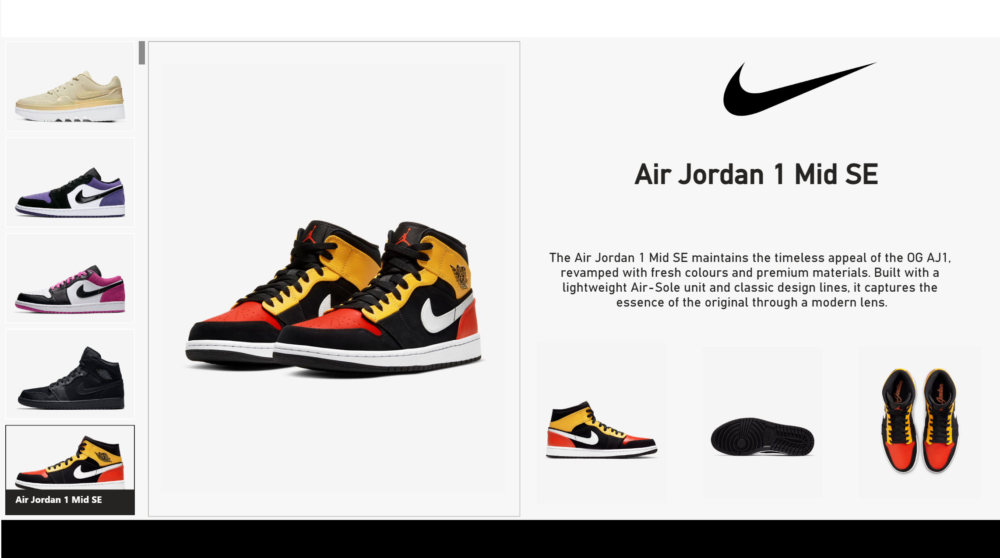

# 👟 Nike Product Interactive Dashboard – Power BI

This Power BI project demonstrates the use of new **Card visuals** and **Button-style slicers** to create a visually engaging and interactive product dashboard. The dashboard uses **Nike sneakers** (e.g., Air Jordan 1 Mid SE) as visual slicer buttons, making it more intuitive and modern compared to traditional filters.

---

## 📸 Dashboard Preview

---

## 🎯 Project Objective

- Showcase **custom KPI cards**, **image slicers**, and **conditional formatting**
- Improve dashboard interactivity using product images as slicers
- Leverage **Power BI's latest features** for a dynamic user experience

---

## 🛠️ Tools & Skills Used

- **Power BI Desktop**
- **DAX & Measures**
- **Power Query**
- **ETL (Extract, Transform, Load)**
- **Data Modeling & Cleaning**
- **Custom Visuals**
- **Image Integration in Slicers**
- **Conditional Formatting**
- **Interactive Navigation**

---

## ✨ Key Features

- Button-style **image slicers** for product selection
- Custom KPI **cards with conditional formatting**
- Responsive layout with dynamic visuals
- Clean data model supporting filter interaction
- Slicer-driven visuals enhancing user engagement

---

## 📁 Files

| File Name                      | Description                           |
|-------------------------------|---------------------------------------|
| `UttamNikeShop.pbix` | Main Power BI dashboard file          |
| `nike-dashboard.png` | Visual preview of dashboard layout    |
| `README.md`                   | Project documentation and overview    |

---

## 👨‍💼 Created By

**Uttam Kumar Sahoo**  
🔗 [LinkedIn](https://www.linkedin.com/in/uttam-kumar-sahoo-549297211/)  
💻 [GitHub](https://github.com/uttam-kumar-sahoo)  
📧 uttamkr.sahoo@gmail.com

---

## 📝 License

MIT License – Free to use and modify.

---

## 💬 Feedback

Contributions and feedback are welcome! Please open an issue or fork the repo to suggest improvements.

